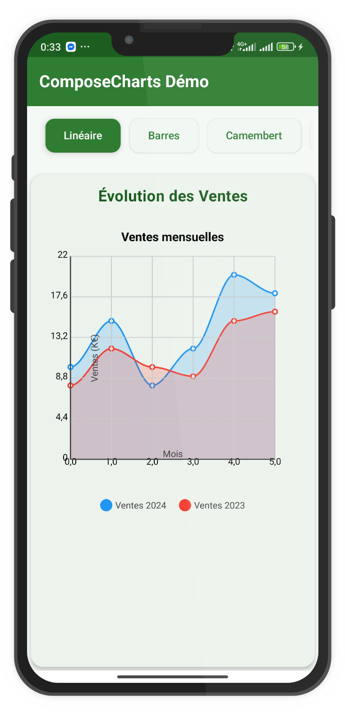
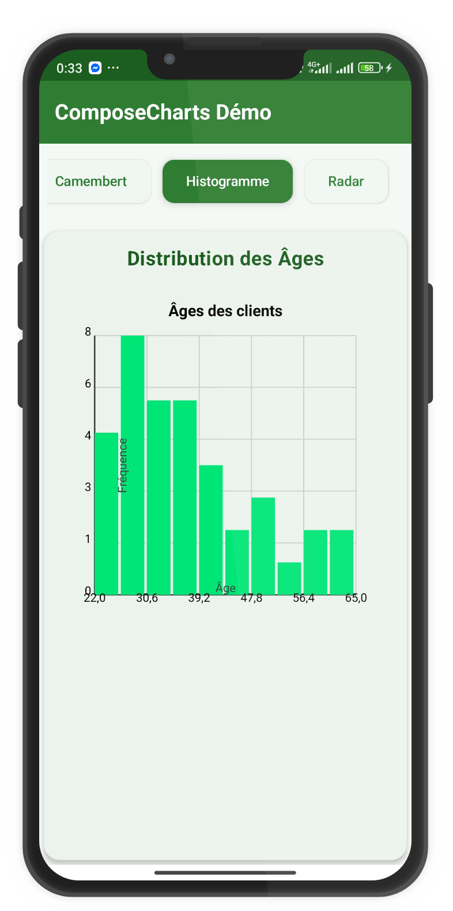
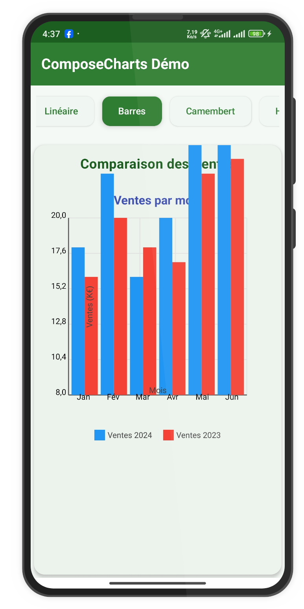
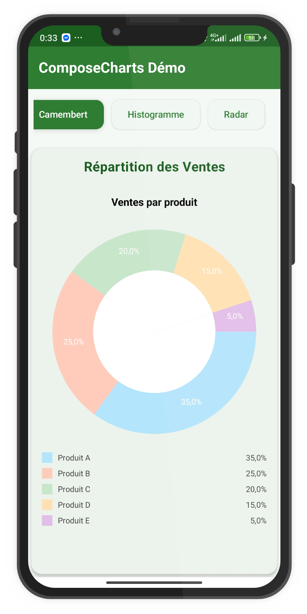
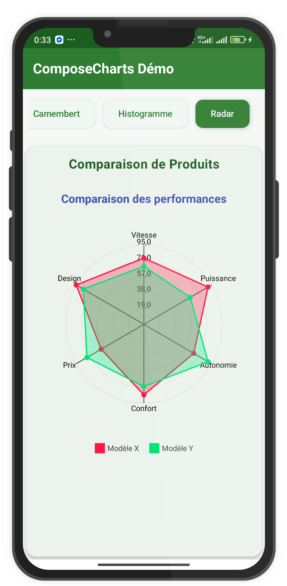
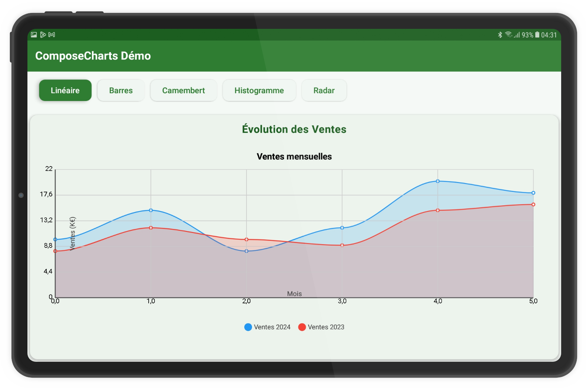
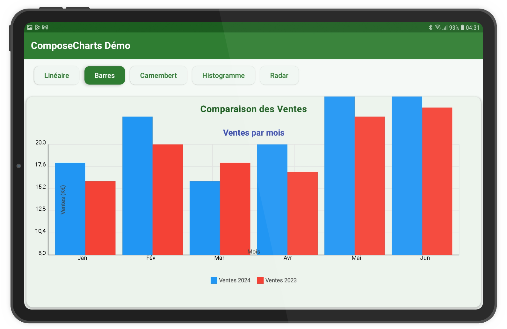
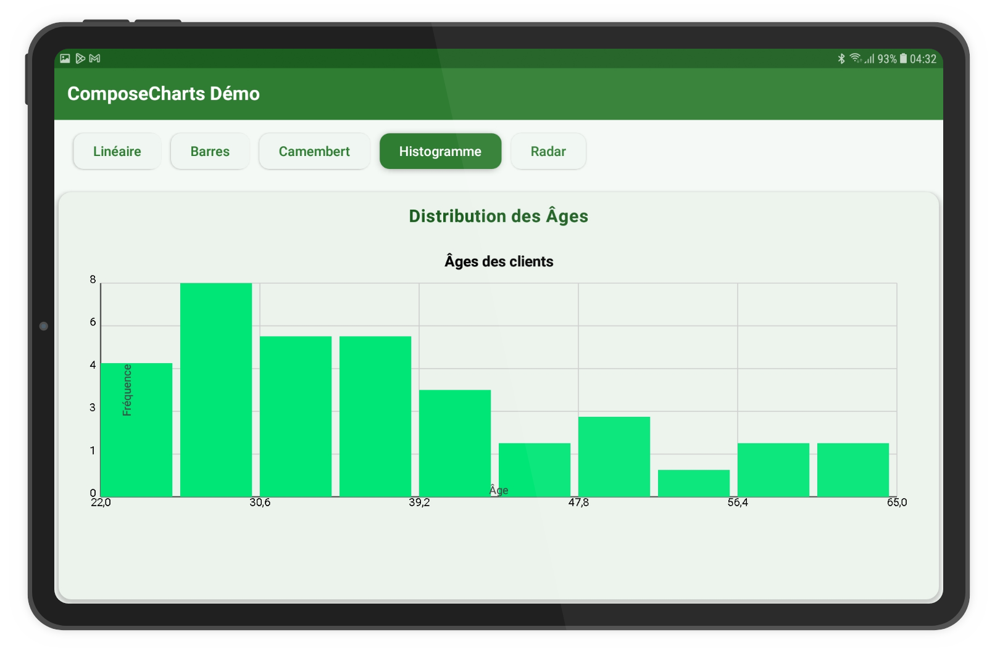

# ComposeCharts Demo

## Introduction

This application demonstrates the use of the ComposeCharts library to create interactive and attractive data visualizations in an Android application using Jetpack Compose. The app showcases five different types of charts and illustrates how to implement them with custom data.

A demonstration of various chart types implemented with Jetpack Compose for Android.

## Chart Gallery

<div align="center">
  <table>
    <tr>
      <td align="center"><br/>Line Chart</td>
      <td align="center"><br/>Histogram</td>
      <td align="center"><br/>Bar Chart</td>
    </tr>
    <tr>
      <td align="center"><br/>Pie Chart</td>
      <td align="center"><br/>Radar Chart</td>
      <td align="center"><br/>Demo Video</td>
    </tr>
  </table>
</div>

## Responsive Layouts

<div align="center">
  <table>
    <tr>
      <td align="center"><br/>Line Chart (Tablet)</td>
      <td align="center"><br/>Bar Chart (Tablet)</td>
      <td align="center"><br/>Histogram (Tablet)</td>
    </tr>
  </table>
</div>

## Features

- **Intuitive user interface** with a navigation bar and chart selection buttons
- **Five types of visualizations**:
  - Line chart
  - Bar chart
  - Pie chart
  - Histogram
  - Radar chart
- **Chart customization** with different themes and color palettes
- **User interactions** (segment highlighting, pie chart explosion)
- **Responsive interface** adapted to different screen sizes

## Code Structure

### MainActivity

`MainActivity` is the entry point of the application. It initializes the Compose user interface and configures the application theme.

```kotlin
class MainActivity : ComponentActivity() {
    override fun onCreate(savedInstanceState: Bundle?) {
        super.onCreate(savedInstanceState)
        setContent {
            MaterialTheme {
                ChartsDemoApp()
            }
        }
    }
}
```

### ChartsDemoApp

This composable is the main structure of the application. It manages the user interface state and organizes the different elements:

```kotlin
@Composable
fun ChartsDemoApp() {
    // Selected chart type
    var selectedChartType by remember { mutableStateOf(ChartType.LINE) }

    Column(modifier = Modifier.fillMaxSize()) {
        // Top bar with title
        TopAppBar(/* ... */)

        // Chart type selection menu
        ChartTypeSelector(/* ... */)

        // Selected chart
        Box(/* ... */) {
            when (selectedChartType) {
                ChartType.LINE -> LineChartExample()
                ChartType.BAR -> BarChartExample()
                ChartType.PIE -> PieChartExample()
                ChartType.HISTOGRAM -> HistogramExample()
                ChartType.RADAR -> RadarChartExample()
            }
        }
    }
}
```

### Chart Type Selection

The application uses a `ChartType` enum to represent the different types of available charts.

```kotlin
enum class ChartType {
    LINE, BAR, PIE, HISTOGRAM, RADAR
}
```

The `ChartTypeSelector` and `ChartTypeButton` composables create a row of buttons allowing the user to choose the type of chart to display:

```kotlin
@Composable
fun ChartTypeSelector(
    selectedChartType: ChartType,
    onChartTypeSelected: (ChartType) -> Unit
) {
    Row(/* ... */) {
        ChartType.values().forEach { chartType ->
            ChartTypeButton(
                type = chartType,
                isSelected = chartType == selectedChartType,
                onClick = { onChartTypeSelected(chartType) }
            )
        }
    }
}
```

### Chart Implementation

#### Line Chart

The line chart displays the evolution of monthly sales over two consecutive years. It uses smooth curves and filled areas for better readability.

```kotlin
@Composable
fun LineChartExample() {
    val salesData = createSalesData()
    
    Column {
        Text(/* ... */)
        
        LineChart(
            dataSeries = salesData,
            title = "Monthly Sales",
            xAxisTitle = "Month",
            yAxisTitle = "Sales (K€)",
            smoothCurve = true,
            showPoints = true,
            fillArea = true,
            /* ... */
        )
    }
}
```

#### Bar Chart

The bar chart allows for comparing monthly sales side by side for two different years. It also displays the numerical values above each bar.

```kotlin
@Composable
fun BarChartExample() {
    val salesData = createSalesData()
    
    Column {
        Text(/* ... */)
        
        BarChart(
            dataSeries = salesData,
            title = "Sales by Month",
            xAxisTitle = "Month",
            yAxisTitle = "Sales (K€)",
            stacked = false,
            horizontal = false,
            showValue = true,
            style = ChartThemes.Colorful,
            /* ... */
        )
    }
}
```

#### Pie Chart

The pie chart (in donut form) shows the distribution of sales by product. It includes interactive features allowing for highlighting and "exploding" selected segments.

```kotlin
@Composable
fun PieChartExample() {
    val segments = listOf(
        PieChartSegment(label = "Product A", value = 35f, color = ColorPalettes.Pastel[0]),
        /* ... */
    )
    
    Column {
        Text(/* ... */)
        
        PieChart(
            segments = segments,
            title = "Sales by Product",
            donut = true,
            showPercentages = true,
            highlightSelection = true,
            explodeSelection = true,
            /* ... */
        )
    }
}
```

#### Histogram

The histogram visualizes the distribution of customer ages by grouping the data into 8 intervals (bins). It also displays the number of occurrences for each interval.

```kotlin
@Composable
fun HistogramExample() {
    val ages = listOf(
        22f, 23f, 24f, /* ... */
    )
    
    Column {
        Text(/* ... */)
        
        Histogram(
            data = ages,
            title = "Customer Ages",
            xAxisTitle = "Age",
            yAxisTitle = "Frequency",
            bins = 8,
            barColor = ColorPalettes.Vibrant[2],
            showValues = true,
            /* ... */
        )
    }
}
```

#### Radar Chart

The radar chart compares the performance of two product models across six different attributes. It uses a dark theme for an interesting visual contrast.

```kotlin
@Composable
fun RadarChartExample() {
    val categories = listOf("Speed", "Power", "Battery Life", "Comfort", "Price", "Design")
    val dataSeries = listOf(
        DataSeries(
            name = "Model X",
            color = ColorPalettes.Vibrant[0],
            points = listOf(/* ... */)
        ),
        DataSeries(
            name = "Model Y",
            color = ColorPalettes.Vibrant[1],
            points = listOf(/* ... */)
        )
    )
    
    Column {
        Text(/* ... */)
        
        RadarChart(
            dataSeries = dataSeries,
            categories = categories,
            title = "Performance Comparison",
            fillArea = true,
            showPoints = true,
            style = ChartThemes.Dark,
            /* ... */
        )
    }
}
```

### Data Generation

The `createSalesData()` function generates the data used by the line and bar charts:

```kotlin
fun createSalesData(): List<DataSeries> {
    return listOf(
        DataSeries(
            name = "Sales 2024",
            color = ColorPalettes.Default[0],
            points = listOf(
                DataPoint(x = 0f, y = 10f, label = "Jan"),
                /* ... */
            )
        ),
        DataSeries(
            name = "Sales 2023",
            color = ColorPalettes.Default[1],
            points = listOf(
                DataPoint(x = 0f, y = 8f, label = "Jan"),
                /* ... */
            )
        )
    )
}
```

## Configuration and Installation

### Prerequisites

- Android Studio Arctic Fox (2021.3.1) or higher
- Kotlin 1.8.0 or higher
- Jetpack Compose 1.5.0 or higher
- Android API 21+ (Android 5.0 Lollipop and later versions)

### Dependencies

Add the JitPack repository to your `settings.gradle` or `settings.gradle.kts` file:

```kotlin
dependencyResolutionManagement {
    repositoriesMode.set(RepositoriesMode.FAIL_ON_PROJECT_REPOS)
    repositories {
        google()
        mavenCentral()
        maven { url = uri("https://jitpack.io") }
    }
}
```

Add the ComposeCharts dependency in your module-level `build.gradle` file:

```kotlin
dependencies {
    implementation("com.github.2zalab:composecharts:1.0.0")
    
    // Other dependencies
    implementation("androidx.core:core-ktx:1.10.1")
    implementation("androidx.lifecycle:lifecycle-runtime-ktx:2.6.1")
    implementation("androidx.activity:activity-compose:1.7.2")
    implementation(platform("androidx.compose:compose-bom:2023.03.00"))
    implementation("androidx.compose.ui:ui")
    implementation("androidx.compose.ui:ui-graphics")
    implementation("androidx.compose.ui:ui-tooling-preview")
    implementation("androidx.compose.material3:material3")
}
```

### Known Issue and Solution

In case of a manifest merger error with the following message:

```
Manifest merger failed : Attribute application@theme value=(@style/Theme.Chartscompo) from AndroidManifest.xml:13:9-49
is also present at [com.github.2zalab:composecharts:1.0.0] AndroidManifest.xml:16:9-51 value=(@style/Theme.Composecharts).
Suggestion: add 'tools:replace="android:theme"' to <application> element at AndroidManifest.xml:5:5-26:19 to override.
```

Modify your `AndroidManifest.xml` file by adding the tools namespace and the `tools:replace` attribute:

```xml
<?xml version="1.0" encoding="utf-8"?>
<manifest xmlns:android="http://schemas.android.com/apk/res/android"
    xmlns:tools="http://schemas.android.com/tools"
    package="com.example.chartsdemo">

    <application
        android:allowBackup="true"
        android:icon="@mipmap/ic_launcher"
        android:label="@string/app_name"
        android:roundIcon="@mipmap/ic_launcher_round"
        android:supportsRtl="true"
        android:theme="@style/Theme.Chartscompo"
        tools:replace="android:theme">
        <!-- Activities and other elements -->
    </application>

</manifest>
```

## Video Demonstration

The demonstration video below shows the application in action, illustrating:
- Navigation between different chart types
- Interaction with charts (segment selection, data point hovering)
- Responsiveness and animations of the visualizations
- Appearance of different themes and color palettes
  
<div align="center">
  <video src="app/src/main/res/raw/composechart.git" controls="controls" style="max-width: 730px;">
  </video>
</div>

## Advanced Features

### Chart Customization

The application demonstrates several ways to customize the appearance of charts:

1. **Predefined themes**: The bar chart uses `ChartThemes.Colorful` and the radar chart uses `ChartThemes.Dark`.

2. **Color palettes**: Different palettes are used depending on the charts:
   - `ColorPalettes.Default` for line and bar charts
   - `ColorPalettes.Pastel` for the pie chart
   - `ColorPalettes.Vibrant` for the histogram and radar chart

3. **Style options**: Each chart type offers specific options such as:
   - `smoothCurve`, `showPoints`, and `fillArea` for line charts
   - `showValue` for bar charts
   - `donut`, `showPercentages`, `highlightSelection`, and `explodeSelection` for pie charts
   - `bins` and `showValues` for histograms

### State Management with Jetpack Compose

The application uses Compose's state API to manage the interactive user interface:

```kotlin
var selectedChartType by remember { mutableStateOf(ChartType.LINE) }
```

This state variable allows the application to react to user selections and update the display accordingly.

## Potential Use Cases

This demo application can be adapted for many professional use cases:

1. **Financial dashboards**: Tracking sales performance, revenue, and trends
2. **Health applications**: Visualization of health, fitness, or nutrition data
3. **Marketing analytics**: Presentation of customer segments and campaign performance
4. **Scientific reports**: Representation of experimental data and research results
5. **Educational applications**: Illustration of statistical and mathematical concepts

## Contribution

Contributions to this project are welcome! Here's how you can contribute:

1. Fork the project
2. Create your feature branch (`git checkout -b feature/amazing-feature`)
3. Commit your changes (`git commit -m 'Add amazing feature'`)
4. Push to the branch (`git push origin feature/amazing-feature`)
5. Open a Pull Request

## License

This project is under the MIT License. See the LICENSE file for more details.
